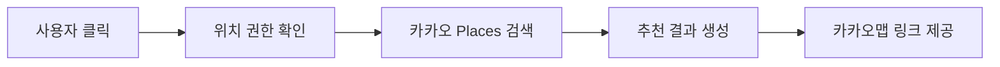

# 🍱 AI Lunch Recommendation

> 내 주변 500m 이내의 식당을 찾아 오늘의 점심을 추천해 주는 간단한 웹 애플리케이션입니다. 🍽️

## 🎯 문제 정의

점심 메뉴를 고르기 어려운 사용자가 빠르게 결정을 내릴 수 있도록, 현재 위치를 기준으로 가까운 식당을 찾아 추천해주는 서비스입니다.

- 📍 사용자의 현재 위치를 기반으로 주변 식당을 탐색합니다.
- 🍽️ 500m 이내의 음식점을 우선적으로 추천합니다.
- 🧭 추천 결과를 한눈에 확인하고, 카카오맵으로 바로 이동할 수 있습니다.

## 🏗️ 아키텍처

이 프로젝트는 단일 페이지 웹 앱 형태로 구성되어 있으며, 사용자의 클릭 이벤트를 받아 위치 기반 검색과 추천 결과를 표시합니다.

## 🛠️ 사용 스택

- HTML5
- CSS3
- JavaScript (Vanilla)
- Kakao Maps JavaScript SDK
- Live Server (로컬 실행용)
- Groq API (llama-3.3-70b-versatile)

## ▶️ 실행 방법

1. 저장소를 클론합니다.
2. 브라우저에서 [ogq3.html](ogq3.html) 파일을 열거나, Live Server로 실행합니다.
3. 화면의 버튼을 클릭합니다.
4. 위치 권한을 허용하면 주변 식당을 검색합니다.
5. 추천된 식당의 상세 정보를 확인할 수 있습니다.

## 🤖 AI 사용 내역

카카오 지도 API로 검색된 주변 식당 정보를 바탕으로, Groq API(llama-3.3-70b-versatile)를 호출하여 맞춤형 추천 사유 문구를 실시간으로 생성합니다.

- 💡 현재 구현: 거리 기반 추천 + 랜덤 추천 결과 표시
- 🚀 확장 가능성: 다중 가중치 기반 AI 사용자 맞춤형 추천 알고리즘 도입

## 📄 라이선스

이 프로젝트는 Apache License 2.0을 사용합니다.

- 자세한 내용은 [LICENSE](LICENSE)를 참고해 주세요.

## 📁 파일 구조

- [ogq3.html](ogq3.html): 메인 웹 페이지 및 로직
- [README.md](README.md): 프로젝트 설명
- [LICENSE](LICENSE): 라이선스 정보
